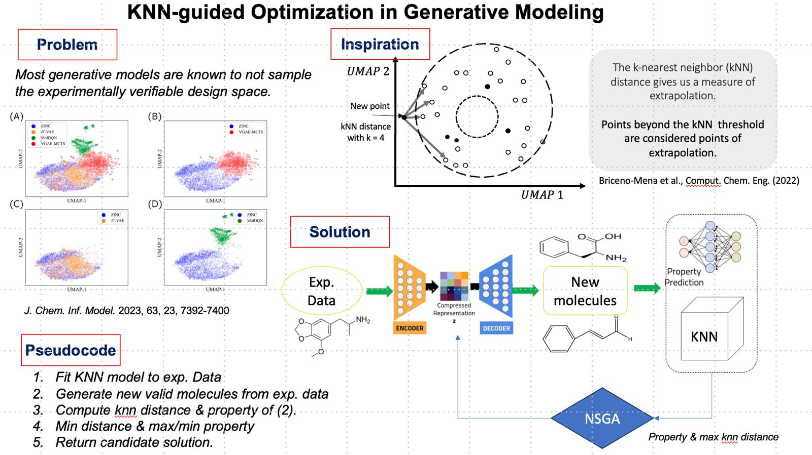

# Neigbor Guided Molecular Optimization
<table>
    <tr valign=top>
        <td width="60%">
            In molecular design, several techniques have emerged enabling the creation of molecules with ~100% validity, uniqueness, and novelty <a href="https://pubs.acs.org/doi/10.1021/acs.jcim.3c01220">(1)</a>. While validity and novelty stand as crucial pillars, ensuring synthesizability presents another formidable challenge. Existing research often falls short in simultaneously optimizing both desired properties and synthesizability. Moreover, extrapolating from the current design space may pose difficulties in achieving synthesizability goals. Therefore, this study introduces an innovative approach that amalgamates the strengths of k-nearest neighbor and non-simulated genetic algorithms to navigate the optimization of molecules.
        </td>
        <td>
            
        </td>
    </tr>
</table>


### Author
| Name | Affilation | Email |
| :-- | :-- | :-- |
| Teslim Olayiwola | Louisiana State University | tolayi1@lsu.edu |

### Environment setup
Python virtual environments are used for this project. Execute the commands below in terminal to install all requirements.
```bash
~$conda env create -f environment.yml # Create the environment 
~$conda activate knnMoleSearch # activate environment
```

### To-Do
- [x] Complete data collection
- [] Train/Pretrain a Generative model
- [] Implement the proposed methodology
